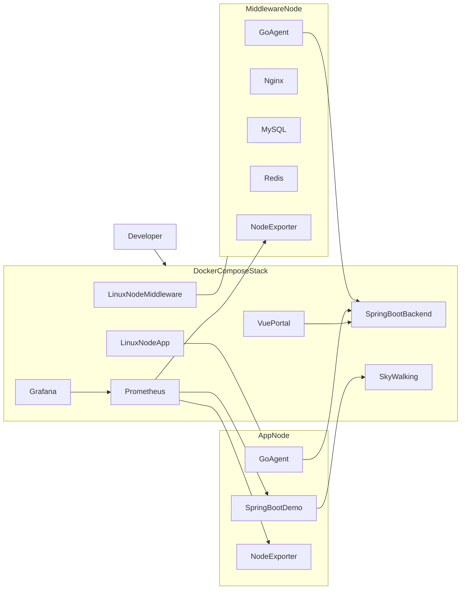

# 课题二初版实现计划

**推荐做法**

采用“`Docker Compose 承载全部运行环境 + 源码挂载进行开发`”的模式：你的机器上只需要 `Docker`/`docker compose`，不直接在宿主机安装 MySQL、Prometheus、Grafana、SkyWalking 或示例服务。前后端、后端、Agent 的开发容器都挂载源码目录，保留热更新与常规调试体验，避免为了“全容器”把开发流程搞复杂。

**现有依据**

- 需求来源：[documents/课题二.md](/Users/cmz/Workspace/软件工程课程设计/documents/课题二.md)
- 技术路线来源：[docs/课题二-技术选型与参考项目推荐.md](/Users/cmz/Workspace/软件工程课程设计/docs/课题二-技术选型与参考项目推荐.md)

**第一版范围**

- 被扫描对象：专门的 Linux 模拟节点容器，不碰宿主机
- Agent 部署方式：每个模拟节点容器内置一个轻量 Agent
- 首批覆盖对象：`Spring Boot + Nginx + MySQL + Redis`
- 平台目标：打通“节点启动 -> Agent 注册/心跳 -> 资产识别 -> Prometheus 抓取 -> Grafana 展示 -> SkyWalking 查看链路”的演示闭环

## 建议目录结构

- [docker-compose.yml](/Users/cmz/Workspace/软件工程课程设计/docker-compose.yml)：统一编排开发、运行、测试环境
- [README.md](/Users/cmz/Workspace/软件工程课程设计/README.md)：本地启动说明、容器化开发说明、演示步骤
- [.env.example](/Users/cmz/Workspace/软件工程课程设计/.env.example)：端口、账号、镜像标签等默认配置
- [backend/](/Users/cmz/Workspace/软件工程课程设计/backend/)：Spring Boot 管理后台
- [frontend/](/Users/cmz/Workspace/软件工程课程设计/frontend/)：Vue 3 统一门户
- [agent/](/Users/cmz/Workspace/软件工程课程设计/agent/)：Go 统一 Agent
- [infra/prometheus/prometheus.yml](/Users/cmz/Workspace/软件工程课程设计/infra/prometheus/prometheus.yml)：采集目标与抓取规则
- [infra/grafana/](/Users/cmz/Workspace/软件工程课程设计/infra/grafana/)：数据源与预置面板
- [infra/skywalking/](/Users/cmz/Workspace/软件工程课程设计/infra/skywalking/)：SkyWalking 相关配置或说明
- [demo-nodes/](/Users/cmz/Workspace/软件工程课程设计/demo-nodes/)：Linux 模拟节点镜像与启动脚本
- [demo-apps/](/Users/cmz/Workspace/软件工程课程设计/demo-apps/)：Spring Boot 示例服务与演示配置
- [tests/](/Users/cmz/Workspace/软件工程课程设计/tests/)：集成/冒烟测试脚本

## 架构草图

## 实施步骤

### 1. 先搭好“低污染、低心智负担”的容器底座

- 创建统一的 [docker-compose.yml](/Users/cmz/Workspace/软件工程课程设计/docker-compose.yml)，只暴露必要端口
- 为 `frontend`、`backend`、`agent` 设计开发容器：源码挂载、依赖缓存卷、热更新命令
- 将 `MySQL`、`Prometheus`、`Grafana`、`SkyWalking` 都作为基础设施容器管理
- 使用 `profiles` 或分组服务，避免默认一次拉起过重组件

### 2. 搭建两个模拟 Linux 节点容器，而不是扫描宿主机

- 在 [demo-nodes/](/Users/cmz/Workspace/软件工程课程设计/demo-nodes/) 下准备至少两类节点镜像：
- `app-node`：包含 `Spring Boot` 示例服务、`Node Exporter`、自研 `Agent`
- `middleware-node`：包含 `Nginx`、`MySQL`、`Redis`、必要 exporter、自研 `Agent`
- 节点容器统一挂入同一内部网络，Agent 只扫描容器内服务与端口，简化权限与安全边界

### 3. 后端只做课程设计需要的最小管理面能力

- 在 [backend/](/Users/cmz/Workspace/软件工程课程设计/backend/) 中先实现：
- Agent 注册接口
- 心跳上报接口
- 主机/节点资产列表接口
- 服务识别结果接口
- 监控入口聚合接口（Grafana、SkyWalking 链接或嵌入信息）
- 数据库先只保留最小表：节点、服务实例、心跳记录、识别结果

### 4. Agent 聚焦“识别和上报”，不要重写监控引擎

- 在 [agent/](/Users/cmz/Workspace/软件工程课程设计/agent/) 中只实现：
- 节点基础信息采集
- 进程/端口扫描
- 基于进程名、端口、命令行的技术栈识别
- 将 `Spring Boot`、`Nginx`、`MySQL`、`Redis` 识别为首批支持类型
- 周期性向后端发送注册、心跳和识别结果
- 不在 Agent 中做时序存储、图表渲染、复杂告警

### 5. 前端先做统一门户和资产页，不急着做复杂大屏

- 在 [frontend/](/Users/cmz/Workspace/软件工程课程设计/frontend/) 中先完成：
- 登录后首页或总览页雏形
- 节点列表页
- 节点详情页
- 服务列表/服务详情页
- 统一跳转到 Grafana 与 SkyWalking 的入口
- 第一版页面重点是“平台感”和“信息组织”，不是自研图表引擎

### 6. 监控链路以复用为主，自研只做串联

- `Prometheus` 负责抓取 `Node Exporter`、`Spring Boot Actuator/Micrometer`、中间件 exporter
- `Grafana` 展示基础主机与服务指标
- `SkyWalking` 用于 `Spring Boot` 示例服务链路展示
- 自研平台只负责把这些已有能力组织成统一入口，而不是替代它们

### 7. 测试与验证也走容器，不污染宿主机

- 在 [tests/](/Users/cmz/Workspace/软件工程课程设计/tests/) 中准备容器化冒烟验证脚本
- 至少验证：
- `docker compose up` 后所有核心容器健康
- Agent 能在节点容器内识别到目标服务
- 后端能查到节点和服务资产
- Prometheus 能抓到关键目标
- Grafana 与 SkyWalking 可访问
- 前端能显示节点和服务清单

## 关键取舍

- 不扫描宿主机：避免权限复杂度、环境差异和“在本机上拉屎”
- 不把开发流程做成“进容器写代码才算容器化”：推荐源码挂载 + 容器内运行，保留正常编辑体验
- 不第一版就做 Kubernetes、日志全文检索、复杂告警编排
- 不让 Agent 承担底层指标引擎职责，只做发现、识别、注册、上报

## 里程碑

1. 基础编排可启动：前端、后端、数据库、Prometheus、Grafana、SkyWalking 容器可拉起
2. 两类模拟节点可启动：节点内服务、exporter、Agent 正常运行
3. Agent 注册链路打通：后台能看到节点和识别结果
4. 监控链路打通：Prometheus/Grafana/SkyWalking 可展示示例数据
5. 统一门户可演示：前端能把资产与外部观测入口组织成一体化平台

## 风险与对应策略

- SkyWalking 体系偏重：第一版可优先保证可启动和可查看基础链路，减少额外定制
- MySQL/Redis/Nginx 全覆盖会拉高首版复杂度：优先保证“能识别 + 能展示 + 有基础指标”，不追求高级指标完整度
- 容器内多进程管理容易混乱：优先用清晰的入口脚本或轻量进程管理方式，避免魔法式镜像
- 首次拉镜像较慢：在 README 中给出分阶段启动命令和最小启动集合

## 我会按这个思路执行

- 先搭统一 `compose` 底座和目录结构
- 再做两个模拟节点与 Agent 最小识别链路
- 然后补后端资产接口与前端页面
- 最后接上 Prometheus、Grafana、SkyWalking 和容器化验证脚本

