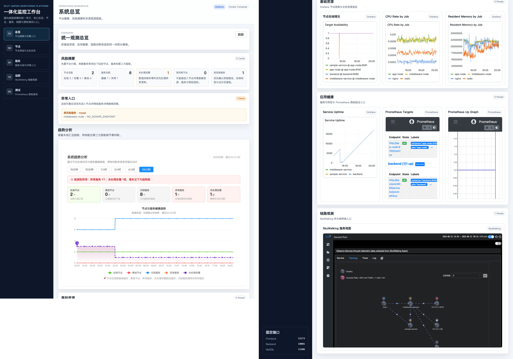

# SCUT Unified Monitoring Platform

课题二“一体化监控平台”的当前实现仓库。项目用 Docker Compose 把业务服务、主机代理、Prometheus、Grafana、SkyWalking 和演示节点串成一套可直接运行的观测环境，前台统一提供总览、节点、服务、链路和调试入口。



## 这套仓库现在能做什么

- 采集节点注册与心跳，并在后端维护节点、服务、历史趋势和异常摘要
- 自动发现演示节点中的 Spring Boot、Nginx、Redis、MySQL、node_exporter 等对象
- 在前台统一展示：
  - 总览页：风险摘要、趋势、Grafana/Prometheus/SkyWalking 嵌入面板
  - 节点页与节点详情页：节点状态、资源指标、服务清单、观测跳转链接
  - 服务页与服务详情页：服务分组、实例信息、Grafana/Prometheus/SkyWalking 跳转
  - 链路页：SkyWalking 工作区嵌入、最近业务 Trace 摘要、完整调用链翻译
  - 调试页：Prometheus Targets 与原始 Query 入口
- 提供一条可持续触发的演示业务链路：`sample-service -> middleware-service -> mysql/redis/nginx`
- 内置 GitHub Actions：PR CI、`main` 分支自动部署、前端 Pages 构建

## 仓库结构

| 路径 | 作用 |
| --- | --- |
| `frontend/` | Vue 3 + Vite 前台，负责统一观测工作台 |
| `backend/` | Spring Boot 后端，提供节点、服务、趋势、链路摘要等 API |
| `agent/` | Go 编写的节点代理，负责注册、心跳和本机服务发现 |
| `demo-apps/` | 演示用业务服务源码：`sample-service`、`middleware-service` |
| `demo-nodes/` | 演示节点镜像定义，打包业务服务、代理和 exporter |
| `infra/` | Prometheus、Grafana、SkyWalking、Maven 镜像源等基础配置 |
| `deploy/` | 远端部署脚本与服务器初始化说明 |
| `tests/` | 冒烟测试与部署/配置回归脚本 |
| `pics/` | 当前界面与后台截图，可直接用于报告或答辩素材 |
| `documents/base/` | 课程设计原始材料与模板文档 |

## 运行前准备

1. 安装 Docker 与 Docker Compose
2. 首次运行前复制环境变量文件：

```bash
cp .env.example .env
```

3. 如果在受限环境或云主机里构建，建议显式关闭 BuildKit：

```bash
export DOCKER_BUILDKIT=0
export COMPOSE_DOCKER_CLI_BUILD=0
```

## 快速启动

### 1. 只启动核心开发环境

适合前后端联调，不包含完整观测栈。

```bash
DOCKER_BUILDKIT=0 COMPOSE_DOCKER_CLI_BUILD=0 \
docker compose up -d mysql backend frontend
```

### 2. 启动完整演示环境

适合课程演示、联调观测链路、跑冒烟测试。

```bash
DOCKER_BUILDKIT=0 COMPOSE_DOCKER_CLI_BUILD=0 \
docker compose --profile observability --profile nodes up -d --build
```

## 默认访问入口

| 服务 | 地址 |
| --- | --- |
| 前台工作台 | `http://localhost:15173/overview` |
| 后端 API | `http://localhost:18081/api/overview` |
| MySQL | `localhost:13306` |
| Prometheus | `http://localhost:19090/prometheus` |
| Grafana | `http://localhost:13000` |
| SkyWalking UI | `http://localhost:18082` |

前台中已通过代理收口了 `/api`、`/prometheus`、`/grafana`，因此日常演示通常只需要打开 `15173`。

## 关键测试命令

### 后端

```bash
docker compose exec backend mvn -q test
```

### 前端

```bash
docker compose exec frontend npm test
docker compose exec frontend npm run build
```

### Agent

```bash
cd agent
go test ./...
```

### 全链路冒烟测试

```bash
bash tests/smoke-test.sh
```

该脚本会拉起完整环境，并验证：

- 后端能收到 `app-node` 与 `middleware-node`
- 服务清单中能看到 `SPRING_BOOT` 和 `MYSQL`
- Prometheus 能抓到 `sample-service`
- SkyWalking 的业务 Trace 摘要中能看到 `/api/demo-chain`

## GitHub Actions

| 工作流 | 触发方式 | 作用 |
| --- | --- | --- |
| `.github/workflows/ci.yml` | PR 到 `main` / 手动触发 | 前端测试与构建、后端测试、Agent 测试 |
| `.github/workflows/deploy-main.yml` | push 到 `main` / 手动触发 | 先跑测试与冒烟，再通过 SSH 执行远端部署脚本 |
| `.github/workflows/pages.yml` | push 到 `main` / 手动触发 | 构建 `frontend/dist` 并发布到 GitHub Pages |

注意：`pages.yml` 发布的是前端静态产物；完整平台部署仍依赖 `deploy-main.yml` 和服务器上的 Docker 环境。

## 常见现象与说明

### `/api` 根路径返回 404

这是预期行为。请直接访问具体接口，例如：

- `/api/overview`
- `/api/nodes`
- `/api/services`
- `/api/tracing/summary`

### 第一次启动后端比较慢

`backend` 容器会先执行 Maven 依赖预热，再启动 `spring-boot:run`，首次拉起需要等一会儿。

### 前端容器每次启动都会执行 `npm install`

依赖通过 Docker 命名卷 `frontend-node-modules` 缓存，首次会慢一些，后续通常稳定。

### 总览里 MySQL 可能显示异常

这是当前实现的已知且基本可解释的现象：Agent 会把 MySQL 识别为服务对象，但本仓库没有为 MySQL 配置 exporter，所以它会以 `NO_SCRAPE_ENDPOINT` 出现在异常服务中。这个状态更接近“已发现但未纳入指标抓取”，不是“数据库已经坏了”。

### `docker compose down -v` 会删数据

带 `-v` 会移除 MySQL、Grafana、Prometheus 等卷。只是临时停服务时请用：

```bash
docker compose down
```

## 进一步阅读

- [docs/项目说明.md](docs/项目说明.md)：答辩/汇报视角的系统说明
- [deploy/server-bootstrap.md](deploy/server-bootstrap.md)：部署服务器初始化说明
- [tests/smoke-test.sh](tests/smoke-test.sh)：当前完整验收脚本

