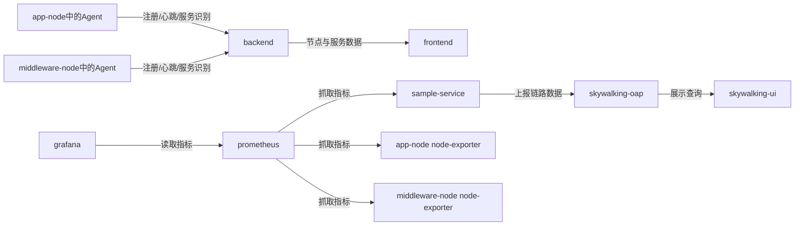
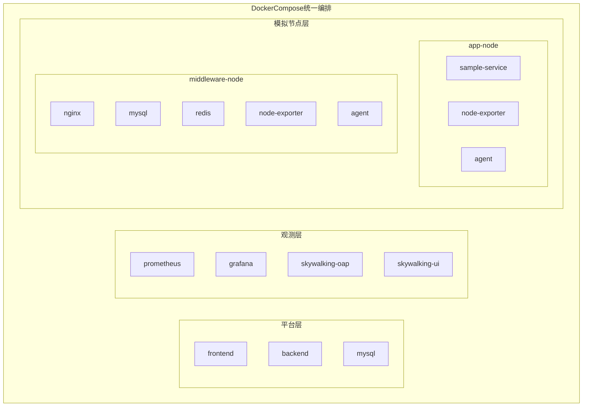

# 课题二初版实现说明

## 1. 文档目的

本文档用于说明课题二“一体化监控平台开发”的当前初版实现成果，重点记录：

- 当前版本的实现范围
- 各模块的职责划分
- 容器化开发、运行、测试方式
- 已打通的核心链路
- 当前版本的验证结果与后续可扩展方向

## 2. 实现目标

结合题目要求与前期技术选型，本次初版实现采用“`自研轻量 Agent + 复用成熟监控底座`”的思路，目标不是从零重写整套监控引擎，而是先完成一个可以演示的最小闭环。

本次已经完成的目标包括：

- 使用容器化环境承载开发、运行和测试，避免在宿主机安装大量中间件
- 搭建统一的 `Docker Compose` 编排环境
- 实现 `Go Agent`，用于扫描专门的 Linux 模拟节点容器
- 实现 `Spring Boot` 后端，负责节点注册、心跳、资产与服务信息管理
- 实现 `Vue 3` 前端门户，展示总览、节点和服务信息
- 接入 `Prometheus + Grafana + SkyWalking`，形成统一监控入口
- 构建两个专门的 Linux 模拟节点容器，分别承载应用服务和中间件服务

## 3. 初版范围

### 3.1 扫描对象

初版不扫描宿主机，而是扫描专门准备的 Linux 模拟节点容器。

这样做的原因是：

- 避免权限与环境差异问题
- 便于在课程设计环境中稳定复现
- 满足“使用容器，但不要让开发更困难”的目标
- 让演示环境与实现边界更清晰

### 3.2 当前支持的服务类型

初版已经支持识别和展示以下对象：

- `SPRING_BOOT`
- `NGINX`
- `MYSQL`
- `REDIS`
- `NODE_EXPORTER`

### 3.3 当前已打通的链路

当前版本已经可以完成以下流程：

1. 启动完整容器环境
2. 启动两个模拟 Linux 节点
3. 节点内 `Agent` 扫描进程与端口
4. `Agent` 向后端注册节点并周期性发送心跳
5. 后端保存节点、服务和状态信息
6. 前端展示节点列表、节点详情、服务清单和总览信息
7. `Prometheus` 抓取应用与节点指标
8. `Grafana` 展示预置监控看板
9. `SkyWalking` 提供示例服务调用链入口

### 3.4 数据流与调用链路图



这张图强调的是“数据怎么流动”。其中最核心的两条主线是：

- 自研链路：`Agent -> Backend -> Frontend`
- 观测链路：`应用/Exporter -> Prometheus -> Grafana`，以及 `应用 -> SkyWalking`

因此，平台本身并不替代 `Prometheus` 或 `SkyWalking`，而是把这些成熟组件组织成统一入口。

## 4. 总体架构

系统当前由以下部分组成：

- `frontend`：Vue 3 统一门户
- `backend`：Spring Boot 管理后台
- `agent`：Go 统一 Agent
- `app-node`：应用型模拟节点
- `middleware-node`：中间件型模拟节点
- `mysql`：平台业务数据库
- `prometheus`：指标采集中心
- `grafana`：监控图表展示
- `skywalking-oap` / `skywalking-ui`：调用链与链路入口

### 4.1 容器层级关系图



这张图强调的是“谁和谁被编排在一起”。最外层是统一的 `Docker Compose` 环境，里面分成平台层、观测层和模拟节点层，可以快速看出平台本身、观测底座、以及被扫描对象三者之间的层次关系。

### 4.2 节点职责

`app-node` 内当前包含：

- `sample-service` 示例 Spring Boot 服务
- `node-exporter`
- `monitor-agent`

`middleware-node` 内当前包含：

- `nginx`
- `mysql`
- `redis`
- `node-exporter`
- `monitor-agent`

### 4.3 平台职责

后端负责：

- Agent 注册
- 心跳接收
- 节点列表查询
- 节点详情查询
- 服务清单查询
- 总览数据与观测入口聚合

前端负责：

- 总览页
- 节点列表页
- 节点详情页
- 服务清单页

## 5. 目录结构

当前仓库核心目录如下：

- `backend/`：Spring Boot 管理后台
- `frontend/`：Vue 3 统一门户
- `agent/`：Go Agent
- `demo-apps/sample-service/`：示例 Spring Boot 服务
- `demo-nodes/`：模拟 Linux 节点镜像
- `infra/prometheus/`：Prometheus 配置
- `infra/grafana/`：Grafana 数据源与看板配置
- `infra/skywalking/`：SkyWalking 说明与接入说明
- `tests/`：容器化冒烟验证脚本
- `docker-compose.yml`：统一容器编排入口

## 6. 容器化策略

本项目的容器化不是为了“所有开发动作都必须进容器里做”，而是为了避免污染宿主机，并保持开发体验可接受。

当前采用的策略是：

- 宿主机只要求安装 `Docker` 与 `docker compose`
- 前后端源码通过挂载目录的方式在容器内运行
- `MySQL`、`Prometheus`、`Grafana`、`SkyWalking` 等运行组件全部在容器内
- 测试优先通过容器完成，避免依赖宿主机工具链完整安装
- 模拟节点也使用容器承载，避免直接扫描宿主机

## 7. 当前已实现页面与接口

### 7.1 前端页面

当前前端已经实现：

- 总览页
- 节点列表页
- 节点详情页
- 服务清单页

### 7.2 后端接口

当前后端已经提供：

- `POST /api/agents/register`
- `POST /api/agents/heartbeat`
- `GET /api/overview`
- `GET /api/nodes`
- `GET /api/nodes/{id}`
- `GET /api/services`

## 8. 当前识别结果

在已完成的联调验证中，后端已经能够识别并返回以下服务信息：

- `sample-service` 对应 `SPRING_BOOT`
- `mysql` 对应 `MYSQL`
- `nginx` 对应 `NGINX`
- `redis` 对应 `REDIS`
- `node-exporter` 对应 `NODE_EXPORTER`

这说明“节点扫描 -> 服务识别 -> 后端注册 -> 前端展示”这条主链路已经打通。

## 9. 验证结果

本次实现已完成以下验证：

### 9.1 Agent 单元测试

已在容器中执行：

```bash
go test ./...
```

验证结果：

- `Agent` 服务识别逻辑测试通过

### 9.2 后端单元测试

已在容器中执行：

```bash
mvn test
```

验证结果：

- 节点注册与心跳处理相关单元测试通过

### 9.3 容器化冒烟测试

已执行：

```bash
bash tests/smoke-test.sh
```

验证结果：

- 全部容器能够构建并启动
- 后端能够接收到 `app-node` 和 `middleware-node` 的注册信息
- 后端服务列表中能够看到 `SPRING_BOOT`、`MYSQL`、`NGINX`、`REDIS`、`NODE_EXPORTER`
- `Prometheus` 可访问并完成目标抓取
- `Grafana` 可访问
- `SkyWalking` 可访问
- 前端可访问

## 10. 当前访问入口

完整环境启动后，可通过以下地址访问：

- 前端：`http://localhost:15173`
- 后端：`http://localhost:18081/api`
- Prometheus：`http://localhost:19090`
- Grafana：`http://localhost:13000`
- SkyWalking UI：`http://localhost:18082`

## 11. 当前版本的边界

当前版本仍然属于“初版实现”，重点是完成可演示闭环，而不是覆盖所有高级能力。

当前尚未深入实现的内容包括：

- 更丰富的中间件 exporter 接入
- 更完整的 Grafana 面板设计
- 更细粒度的告警与规则管理
- 更完善的用户权限体系
- 更复杂的技术栈识别规则
- Kubernetes、日志检索、复杂编排等扩展能力

## 12. 后续建议

如果继续迭代，建议优先按以下顺序推进：

1. 为 `MySQL`、`Redis`、`Nginx` 接入更完整的 exporter 和指标展示
2. 丰富前端总览页和节点详情页的展示内容
3. 增强 Agent 的识别规则与异常处理能力
4. 为后端补充更完整的持久化模型与筛选查询能力
5. 增加更多自动化测试和答辩演示脚本

## 13. 结论

课题二当前已经完成一个可运行、可展示、可验证的初版实现。  
该版本满足了“容器化开发/运行/测试”“扫描专门的 Linux 模拟节点容器”“自研 Agent + 统一平台 + 复用成熟监控底座”的核心方向，并为后续继续扩展成更完整的课程设计成果打下了基础。
