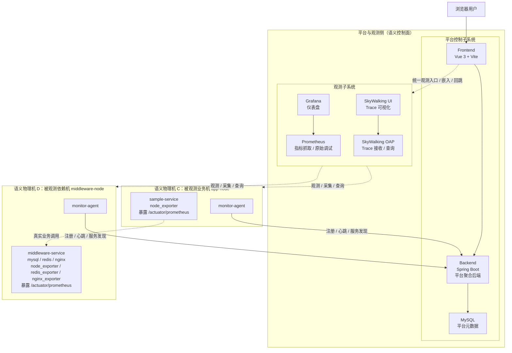
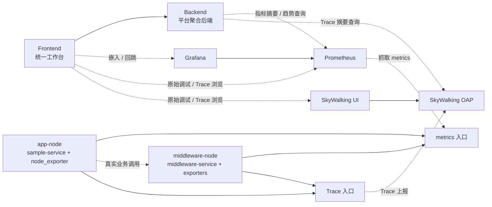

# 项目说明

## 1. 课题背景与项目定位

本项目对应《软件工程课程设计》课题二“一体化监控平台开发”。题目本身有三个很明确的关键词：

1. 开发 Agent，并部署在主机设备上
2. Agent 能自动扫描、发现、识别主机上的服务和组件
3. 采集到的信息要通过监控台统一展示，包括主机信息、主机利用率、技术栈与服务信息、指标和调用链

从当前仓库的实现方式看，项目并没有把目标理解成“从零造一整套监控中间件”，而是把它理解成“围绕统一工作台，集成并打通监控数据链路”。因此本项目的定位是：

- **Agent 层**负责节点注册、主机指标采集、服务发现
- **Backend 层**负责把原始节点、服务、心跳、快照、链路摘要聚合成前台真正需要的数据
- **Observability 层**复用 Prometheus、Grafana、SkyWalking 的成熟能力
- **Frontend 层**把总览、节点、服务、Tracing、调试入口收拢为统一工作台

也就是说，本项目的核心价值不是替代 Prometheus / Grafana / SkyWalking，而是把它们与自研 Agent、平台聚合后端、桌面工作台结合起来，形成一套可部署、可演示、可排障的一体化监控系统。

## 2. 题目要求与当前实现的对应关系

结合课题原始描述，当前仓库已实现的映射关系如下：

| 课题要求 | 当前实现 |
| --- | --- |
| Agent 部署到主机 | `app-node`、`middleware-node` 两个演示节点都内置 `monitor-agent` |
| 自动扫描、发现、识别服务和组件 | Agent 通过 `ps` 与 `ss -ltnp` 识别 Spring Boot、MySQL、Redis、Nginx、node_exporter |
| 展示主机信息 | 后端维护 `ManagedNode`，前台展示主机名、IP、OS、Agent 版本、状态 |
| 展示主机利用率 | Agent 采集 CPU、内存、磁盘、网络，后端存为 `NodeMetrics`，前台在节点页与节点详情页展示 |
| 展示技术栈和服务信息 | `DiscoveredService` 保存服务名、类型、端口、进程、抓取路径、指标端口 |
| 展示服务指标 | Prometheus 抓取 Spring Boot、node_exporter、nginx_exporter、redis_exporter；Grafana 面板嵌入前台 |
| 展示调用链 | SkyWalking 采集业务 Trace，后端额外生成 Trace 摘要和完整调用链预览 |
| 支持问题快速发现和定位 | 总览页风险摘要、异常入口、趋势图、快捷跳转链接形成初步排障闭环 |

从课程设计完成度看，这一版已经不只是“能展示页面”，而是把题目要求中的 Agent、服务发现、指标采集、调用链、前台展示基本串成了完整闭环。

## 3. 总体架构

### 3.1 系统组成

项目采用容器化部署，核心组件包括：

- `frontend`：Vue 3 + Vite 实现的统一工作台
- `backend`：Spring Boot 后端
- `mysql`：后端元数据存储
- `prometheus`：统一抓取指标
- `grafana`：仪表盘展示
- `skywalking-oap`：链路追踪后端
- `skywalking-ui`：链路追踪可视化界面
- `app-node`：演示入口节点，内含业务服务、node_exporter、Agent、SkyWalking Java Agent
- `middleware-node`：演示依赖节点，内含中间件、业务服务、多个 exporter、Agent、SkyWalking Java Agent

### 3.2 角色与语义拓扑

先看角色分工与语义拓扑。这张图只回答“谁和谁是一类角色、谁和谁发生主交互”，不展开 metrics 与 Trace 的具体流向。



### 3.3 观测数据流

再看 metrics 与 Trace 如何流动。这张图不再强调物理分组，而是只关注“谁采、谁上报、谁查询、谁展示”。



### 3.4 架构特点

1. **平台后端与第三方观测系统分层明确**  
   后端不直接承担时间序列数据库或链路追踪存储，而是专注于节点注册、状态聚合、异常判断、趋势快照和链路摘要加工。

2. **统一工作台而不是多个孤立后台**  
   用户在前台就能完成总览、节点查看、服务查看、Tracing 浏览和 Prometheus 原始调试，不必频繁切换多个系统。

3. **演示链路是真实闭环而不是静态样例**  
   `sample-service -> middleware-service -> mysql/redis/nginx` 这条业务链路是真实运行的，SkyWalking 与 Prometheus 的数据也是由真实流量与真实 exporter 产生。

4. **实现策略偏“课程演示级工程闭环”**  
   代码不仅能在本地运行，还有自动化测试、自动部署和冒烟验证流程，适合作为课程设计答辩与展示基础。

## 4. 容器与部署拓扑

### 4.1 Docker Compose 结构

`docker-compose.yml` 里把整个平台分成三层：

1. **核心开发层**
   - `mysql`
   - `backend`
   - `frontend`

2. **观测层（profile: observability）**
   - `prometheus`
   - `grafana`
   - `skywalking-oap`
   - `skywalking-ui`

3. **演示节点层（profile: nodes）**
   - `app-node`
   - `middleware-node`

这种分层带来的好处是：

- 前后端联调时可以只起核心环境，启动快
- 演示或验收时再补起完整观测与节点环境
- smoke test 和 deploy 脚本都能直接针对完整拓扑运行

### 4.2 关键端口

| 服务 | 端口 | 说明 |
| --- | --- | --- |
| Frontend | `15173` | 统一工作台 |
| Backend | `18081` | 平台后端 API |
| MySQL | `13306` | 平台数据存储 |
| Prometheus | `19090` | 指标抓取与原始调试 |
| Grafana | `13000` | 仪表盘后台 |
| SkyWalking UI | `18082` | 链路追踪后台 |

其中用户日常只需要访问 `15173`，因为前台已经通过代理收口了：

- `/api`
- `/prometheus`
- `/grafana`

SkyWalking 则直接通过公开地址嵌入。

### 4.3 前台嵌入能成立的关键配置

统一工作台之所以能把第三方系统嵌进去，不只是前端写了 iframe，而是整套配置做了配合：

- Prometheus 使用 `--web.external-url` 和 `--web.route-prefix=/prometheus`
- Grafana 开启 `GF_SECURITY_ALLOW_EMBEDDING=true`
- Grafana 配置 `GF_SERVER_ROOT_URL=/grafana` 与 `GF_SERVER_SERVE_FROM_SUB_PATH=true`
- 前端通过 `VITE_*_BASE_URL` 和代理目标把路径统一映射到浏览器可访问地址
- 后端也会向前台或详情页回传 Grafana / Prometheus / SkyWalking 的快捷链接

这说明该平台并不是“静态截图式集成”，而是真正考虑了路径、代理、嵌入与跳转的一致性。

## 5. 后端设计

### 5.1 技术栈与定位

后端基于：

- Spring Boot 3.3.5
- Java 21
- Spring Web
- Spring Data JPA
- MySQL
- Micrometer Prometheus Registry

其定位不是简单 CRUD，而是**平台聚合层**。前端看到的大部分结构化摘要，都是后端在原始节点、服务、心跳和链路数据之上二次加工出来的。

### 5.2 核心控制器

后端控制器职责分得比较清楚：

#### `AgentController`

负责 Agent 写入入口：

- `POST /api/agents/register`
- `POST /api/agents/heartbeat`

控制器本身很薄，几乎只承担参数接收和转发，真正逻辑下沉到服务层。这种设计避免了把状态机逻辑写在 Controller 里。

#### `PortalController`

负责前台读接口：

- `GET /api/overview`
- `GET /api/nodes`
- `GET /api/nodes/{id}`
- `GET /api/services`
- `GET /api/services/{id}`
- `GET /api/trends`
- `GET /api/tracing/summary`

它相当于前台统一门面，向页面提供聚合好的 DTO，而不是把数据库实体直接暴露给前端。

### 5.3 核心服务层

#### `NodeRegistryService`

这是后端最关键的服务类，承担了四类职责：

1. **节点注册**
   - 节点不存在则创建
   - 更新节点基本信息
   - 同步当前发现到的服务清单

2. **心跳处理**
   - 校验状态值是否合法
   - 刷新 `lastSeenAt` / `lastHeartbeatAt`
   - 写入 `HeartbeatEvent`
   - 清洗与归一化 CPU、内存、磁盘、网络指标
   - 将本次缺失的指标与上一条 `NodeMetrics` 做合并，避免局部缺值导致图表断裂

3. **读侧聚合**
   - 生成总览页需要的节点/服务计数
   - 生成异常入口
   - 生成节点详情、服务详情
   - 拼装快捷跳转链接（Grafana / Prometheus / SkyWalking）

4. **趋势数据管理**
   - 保存平台级 `MetricsSnapshot`
   - 清理旧快照与旧节点指标
   - 查询并组装 `/api/trends`

从工程视角看，`NodeRegistryService` 的价值在于：它把“平台注册、状态、异常、趋势、详情、跳转链接”这几个本来分散的问题统一收敛到了一个平台聚合层中。

#### `SkyWalkingQueryService`

这个类让平台不仅仅是嵌入 SkyWalking UI，而是具备了一层“面向排障者的摘要能力”：

1. 通过 GraphQL 查询最近 1 小时基础 trace 列表
2. 过滤 `/actuator/prometheus` 这类噪音请求
3. 合并同一条 Trace 的多个片段
4. 再补查最新业务 Trace 的 span 详情
5. 从 Exit span 里推断 `mysql / redis / nginx` 依赖链
6. 生成：
   - 最近业务 Trace 列表
   - 最新完整调用链摘要
   - 服务链
   - 依赖链

这使得前台链路页能先给出“结构化摘要”，再把用户引导到 SkyWalking 原视图，而不是一上来就把原生界面整块甩给用户。

### 5.4 调度器设计

`MetricsCollectionScheduler` 负责后台时序工作：

- 应用启动时回填旧节点的 `lastHeartbeatAt`
- 每 5 分钟保存一条平台级快照
- 每周清理超过保留期限的快照与节点指标

这部分设计很重要，因为它说明总览页的趋势图不是临时拼出来的，而是后端主动维护的一组本地汇总时序数据。

### 5.5 数据模型设计

后端核心实体一共五个：

#### `ManagedNode`

表示一个已纳管节点，包含：

- 节点名
- 主机名
- IP
- OS
- Agent 版本
- 当前状态
- 最近上线时间
- 最近心跳时间
- 服务集合

它是平台里“节点视角”的主表。

#### `DiscoveredService`

表示某节点上发现到的一个服务，包含：

- 服务名
- 服务类型
- 服务端口
- 进程名
- 指标路径
- 指标端口
- 所属节点

它是平台里“服务视角”的主表。

#### `HeartbeatEvent`

只记录“某节点某时刻上报过什么状态”，主要用于保留心跳历史与后续扩展审计能力。

#### `NodeMetrics`

记录节点级资源时序：

- CPU 使用率
- 内存使用率 / 总量 / 已用量
- 磁盘使用率 / 总量 / 已用量
- 网络收发速率

这是节点详情页资源监控的后端基础。

#### `MetricsSnapshot`

记录平台级快照：

- 总节点数
- 在线节点
- 离线节点
- 告警节点
- 总服务数
- 健康服务数
- 异常服务数
- 未处理告警数

这是总览页趋势分析的基础。

## 6. Agent 设计

### 6.1 技术栈与主循环

Agent 使用 Go 1.23 编写，整体结构简洁，核心由以下模块组成：

- `config`：读取环境变量
- `system`：采集主机名、IP、OS
- `discovery`：服务发现
- `metrics`：主机资源采集
- `httpclient`：向后端发送 JSON 请求
- `types`：定义注册与心跳 payload

Agent 启动后的工作节奏是：

1. 读取配置
2. 先注册一次
3. 先发一次心跳
4. 之后按 `registerTicker` 周期重注册
5. 按 `heartbeatTicker` 周期发心跳

这意味着：

- **注册**负责刷新节点与服务清单
- **心跳**负责刷新状态与主机指标

两者职责被有意识地分开了。

### 6.2 服务发现规则

Agent 的服务发现并不是依赖 Kubernetes、Consul 之类的注册中心，而是基于操作系统视角直接扫描：

- `ps -eo pid,comm,args --no-headers`
- `ss -ltnp`

然后按规则分类：

- `java + sample-service` -> `SPRING_BOOT`
- `java + middleware-service` -> `SPRING_BOOT`
- `nginx` -> `NGINX`
- `mysqld / mariadbd` -> `MYSQL`
- `redis-server` -> `REDIS`
- `node_exporter` -> `NODE_EXPORTER`

这里有两个很值得在答辩中强调的点：

1. **发现逻辑是自动化的，不靠手工录入**
2. **识别结果不仅有服务名与类型，还有 metricsPath / metricsPort**

也就是说，Agent 上报的并不是“这台机器上大概有个 Redis”，而是“这台机器上有个 Redis，它应该被怎样抓指标”。

### 6.3 主机指标采集

Agent 心跳会采集：

- CPU：读取 `/proc/stat`，用两次采样差值估算
- 内存：读取 `/proc/meminfo`
- 磁盘：调用 `df`
- 网络：读取 `/proc/net/dev`，用前后两次字节差换算 Mbps

这个设计说明项目不只是“会调外部 API”，而是已经具备了比较原生的 Linux 主机指标采集能力。

## 7. 演示节点与业务链路设计

### 7.1 `app-node`

`app-node` 容器内包含：

- `sample-service`
- `node_exporter`
- `monitor-agent`
- SkyWalking Java Agent
- `traffic-generator.sh`

其作用是承担业务入口和持续造流量。

### 7.2 `middleware-node`

`middleware-node` 容器内包含：

- `middleware-service`
- MySQL
- Redis
- Nginx
- `node_exporter`
- `nginx-prometheus-exporter`
- `redis_exporter`
- `monitor-agent`
- SkyWalking Java Agent

它的作用不是单独扮演一类服务，而是把一组典型依赖集中到一个节点里，便于演示调用链和监控覆盖。

### 7.3 业务链路

#### 入口服务：`sample-service`

暴露：

- `GET /api/hello`
- `GET /api/demo-chain`

其中 `/api/demo-chain` 会调用：

- `http://middleware-node:8082/api/middleware/profile?user=...`

#### 中间服务：`middleware-service`

暴露：

- `GET /api/middleware/profile`

一次请求中它会依次：

1. 用 `JdbcTemplate` 执行 `SELECT 1`
2. 写入并读取 Redis Key
3. 请求本机 `http://127.0.0.1/` 访问 Nginx

因此，一次业务请求天然覆盖：

- 服务间 HTTP 调用
- 数据库访问
- 缓存访问
- 中间件访问

这条链路非常适合演示“从业务入口到基础依赖”的完整可观测性。

### 7.4 自动业务流量

`traffic-generator.sh` 每 20 秒会触发一次：

```bash
curl -fsS "http://127.0.0.1:8081/api/demo-chain?user=demo-user"
```

这样做有两个作用：

1. 持续制造真实业务 Trace，避免 SkyWalking 页面空白
2. 为 Prometheus、Grafana、SkyWalking 提供持续变化的数据

这意味着项目里的监控数据不是完全静态的，而是带有业务节奏的。

## 8. 前端设计

### 8.1 技术栈与组织方式

前端采用：

- Vue 3
- Vite
- Vue Router
- ECharts

代码组织上大致分成三层：

1. **页面层 `pages/`**
2. **通用组件层 `components/`**
3. **服务层 `services/`**

### 8.2 路由与工作台分区

前端路由包括：

- `/overview`
- `/nodes`
- `/nodes/:id`
- `/services`
- `/services/:id`
- `/tracing`
- `/debug`

这种设计把平台工作流拆成五种排障视角：

1. **总览视角**：先看平台健康和异常入口
2. **节点视角**：从主机资源和节点状态切入
3. **服务视角**：从服务类型、指标和归属关系切入
4. **链路视角**：从业务 Trace 和服务依赖切入
5. **调试视角**：回到 Prometheus 原始 targets 与 query 验证

这符合实际运维排障时“先总览，再下钻”的思路。

### 8.3 服务层设计

#### `api.js`

负责调用平台后端 JSON API，例如：

- `fetchOverview`
- `fetchNodes`
- `fetchNodeDetail`
- `fetchServices`
- `fetchServiceDetail`
- `fetchTracingSummary`
- `fetchTrends`

#### `prometheus.js`

负责调用 Prometheus API 并把原始 targets 归纳成结构化摘要，例如：

- 总 targets 数
- 正常 targets 数
- 异常 targets 数
- scrape pool 数
- 最慢 scrape 对象

#### `observability.js`

负责统一构建：

- Grafana panel URL
- Grafana dashboard URL
- Prometheus Graph URL
- Prometheus Targets URL
- SkyWalking URL

并进一步生成：

- 总览页 panel groups
- 节点详情页 panel groups
- 服务详情页 panel groups
- 链路页 panel groups
- 调试页 panel groups

也就是说，前端没有把第三方观测入口散落在各个页面里，而是通过单独的服务层统一封装了“怎么访问 Grafana / Prometheus / SkyWalking”。

### 8.4 页面设计思路

#### 总览页 `OverviewPage`

负责：

- 风险摘要
- 异常入口
- 趋势分析
- Grafana / Prometheus / SkyWalking 总览面板

它的设计目标是：**先告诉用户哪里有风险，再告诉用户去哪里下钻。**

#### 节点页 `NodesPage`

负责：

- 节点筛选
- 关键字搜索
- 服务类型过滤
- 心跳排序
- 节点列表

说明该项目不仅能展示数据，还考虑了工作台可用性。

#### 节点详情页 `NodeDetailPage`

拆成四个标签页：

- 资源监控
- 服务清单
- 链路关联
- 原始监控

其中既保留结构化摘要，也保留原始监控入口，适合实际排障流程。

#### 服务页 `ServicesPage`

按 `serviceType` 分组服务，并统计缺失抓取路径的服务数。这种视图比单纯列表更适合展示“平台发现了什么、哪些地方还没接全监控”。

#### 服务详情页 `ServiceDetailPage`

拆成：

- 运行指标
- 调用链
- 基础信息
- Prometheus 调试

如果服务缺少 `metricsPath`，页面会直接给出警告横幅，这体现了前台对“接入完整性”的关注。

#### 链路页 `TracingPage`

它不是直接把 SkyWalking UI 整块嵌进去，而是先给出：

- 链路摘要
- 排查提示
- 最近业务 Trace
- 最新完整调用链

然后再嵌入 SkyWalking 工作区。  
这是前台对链路数据做“可读化”和“排障导向化”的体现。

#### 调试页 `DebugPage`

先总结 Prometheus 采集健康度，再提供原始调试面板，帮助区分：

- 是展示层有问题
- 还是 Prometheus 本身没抓到数据

## 9. 四条关键数据流

### 9.1 Agent 注册流

流程如下：

1. Agent 读取环境配置
2. 采集主机信息
3. 扫描当前进程与监听端口
4. 识别服务与技术栈
5. 组装 `RegisterPayload`
6. `POST /api/agents/register`
7. 后端注册节点并同步服务集合

这条链路实现了“节点纳管 + 服务发现”的平台基础能力。

### 9.2 心跳与主机指标流

流程如下：

1. Agent 采集 CPU / 内存 / 磁盘 / 网络
2. 组装 `HeartbeatPayload`
3. `POST /api/agents/heartbeat`
4. 后端校验状态
5. 写入 `HeartbeatEvent`
6. 写入或更新 `NodeMetrics`
7. 前台节点视图与节点详情读取这些聚合结果

这条链路实现了“状态监控 + 主机资源监控”。

### 9.3 平台趋势快照流

流程如下：

1. 定时器每 5 分钟触发
2. 后端统计节点与服务当前状态
3. 生成 `MetricsSnapshot`
4. 存库
5. `/api/trends` 根据时间窗读取快照
6. 前台趋势图渲染

这条链路说明平台并非只依赖第三方时序查询，而是保留了本地的“平台级管理视角趋势”。

### 9.4 链路摘要流

流程如下：

1. 演示业务流量触发 `demo-chain`
2. SkyWalking Java Agent 把 Trace 发往 OAP
3. 后端调用 SkyWalking GraphQL
4. 过滤噪音 Trace
5. 合并业务 Trace
6. 补查 span 详情
7. 生成业务入口、服务链、依赖链、链路规模
8. 前台链路页以本地摘要形式展示

这条链路说明该平台做的不只是“嵌 SkyWalking”，而是做了平台侧二次理解和摘要加工。

## 10. 状态判定与异常设计

### 10.1 节点状态不是原样照搬

后端不是直接显示 Agent 上报的 `ONLINE / OFFLINE / WARNING`，而是加入了二次判定：

- 心跳缺失 -> `WARNING`
- 心跳超时 -> `WARNING`
- Agent 主动告警 -> `WARNING`

这类规则更像真实监控平台对状态的解释层，而不是简单透传。

### 10.2 服务异常的定义

当前平台把“异常服务”主要定义为：

- 服务已被识别
- 但没有可抓取的 `metricsPath`

前台统一展示为：

- `NO_SCRAPE_ENDPOINT`

这个设计有一个非常适合答辩主动说明的案例：**MySQL**。  
Agent 能发现 MySQL，但当前仓库没有为它接入 exporter，所以它会被识别出来，同时也会出现在异常入口里。这个异常代表“已发现但监控接入不完整”，而不代表数据库已经故障。

### 10.3 快捷链接设计

无论是节点详情还是服务详情，后端都会生成：

- Grafana
- Prometheus
- SkyWalking

三类快捷跳转链接。  
这说明平台不是试图把所有功能都重写，而是把结构化摘要和原始后台视图结合起来，让用户能顺着排障路径继续下钻。

## 11. 测试体系

### 11.1 模块级测试

PR CI 当前只跑三类模块级验证：

1. **前端**
   - `npm ci`
   - `npm test`（Vitest）
   - `npm run build`

2. **后端**
   - `mvn -q test`

3. **Agent**
   - `go test ./...`

这三层覆盖了：

- 前端路由、页面装配、服务层请求与观测 URL 构造
- 后端控制器、服务聚合逻辑、调度器逻辑
- Agent 的服务发现规则和网络采样逻辑

### 11.2 配置回归测试

部署工作流还额外跑了三类配置回归：

- SkyWalking agent 来源检查
- Prometheus route-prefix 检查
- 部署脚本观测配置检查

这些测试的价值在于：  
它们不是验证业务逻辑，而是防止“路径配错、镜像源改坏、部署脚本删掉关键等待逻辑”这类工程回归。

### 11.3 全链路冒烟测试

`tests/smoke-test.sh` 会完整拉起：

- observability profile
- nodes profile

并验证：

1. 核心入口可达
2. `app-node` 与 `middleware-node` 已注册
3. 服务清单中存在 `SPRING_BOOT` 与 `MYSQL`
4. Prometheus 已抓到 `sample-service`
5. 链路摘要中出现 `/api/demo-chain`

这套冒烟验证的意义很强，因为它已经覆盖了：

- 容器编排
- Agent 注册
- 服务发现
- 指标抓取
- 链路追踪

换句话说，它验证的是“平台闭环是否真的成立”。

## 12. GitHub Actions 与自动部署

### 12.1 PR CI

`.github/workflows/ci.yml` 在 PR 到 `main` 时运行，策略比较克制：

- 只跑前端、后端、Agent 三块
- 不跑 smoke test
- 不做部署

这使 PR 校验更快，但也意味着 PR 级别不是完整集成验证。

### 12.2 `main` 自动部署工作流

`.github/workflows/deploy-main.yml` 则更完整：

1. 前端测试与构建
2. 后端测试
3. Agent 测试
4. 配置回归测试
5. smoke test
6. SSH 远程部署

它还配置了 `concurrency: deploy-main`，防止多个部署同时进行。

### 12.3 远端部署脚本的真实行为

`deploy/deploy-main.sh` 做的事情并不只是“docker compose up”：

1. 检查部署目录是不是 Git 仓库
2. 备份 `.env`
3. `git fetch origin main`
4. `git checkout -f main`
5. `git reset --hard origin/main`
6. 恢复 `.env`
7. 重新拉起完整观测栈与节点栈
8. 等待前后端、Prometheus、Grafana、SkyWalking 就绪
9. 检查节点注册与服务识别
10. 检查 Prometheus targets
11. 主动 warmup `demo-chain`
12. 轮询 `/api/tracing/summary` 直到出现业务 Trace

这说明自动部署已经具备“部署后自检”的基本能力，而不是单纯把代码推上去就结束。

### 12.4 GitHub Pages 的角色

仓库还带有 `pages.yml`，但它只负责：

- 构建 `frontend/dist`
- 发布到 GitHub Pages

它不等于完整平台上线。完整平台上线仍依赖 `deploy-main.yml` 和目标服务器上的 Docker 环境。

## 13. 当前实现的亮点

如果从课程设计角度来总结，这一版最值得讲的亮点有以下几个：

### 13.1 不是空壳页面，而是真实系统闭环

项目包含：

- 自研 Agent
- 自研聚合后端
- 真实演示服务
- 真实中间件依赖
- Prometheus / Grafana / SkyWalking 集成
- 自动化测试与自动部署

因此它更像一套完整监控平台雏形，而不是单纯的前端展示作业。

### 13.2 平台后端做了“聚合与解释”

后端不是简单透传第三方系统数据，而是自己承担了：

- 状态解释
- 风险摘要
- 快捷跳转
- 趋势快照
- Trace 摘要
- 依赖链提炼

这正是“一体化平台”应有的价值。

### 13.3 链路页做了二次可读化

SkyWalking 并不是原样嵌入就完事了。平台还提供了：

- 最近业务 Trace 列表
- 最新完整调用链预览
- 服务链
- 依赖链
- 排查提示

这让链路数据更适合课堂展示和答辩说明。

### 13.4 部署和验证闭环较完整

课程项目常见问题是“本地能跑、离开作者电脑就不稳定”。  
本项目至少已经做到：

- Docker Compose 统一编排
- GitHub Actions 自动测试
- `main` 自动部署
- 部署后自动自检

这会明显增强项目的工程可信度。

## 14. 当前边界与已知限制

### 14.1 MySQL 未接入独立 exporter

MySQL 当前会被识别为服务，但没有完整 metricsPath，因此在前台可能显示为 `NO_SCRAPE_ENDPOINT`。  
这属于“监控接入边界”，不是“数据库故障”。

### 14.2 SkyWalking Trace 依赖真实业务流量

如果没有触发 `demo-chain`，链路页可能暂时没有业务 Trace。虽然仓库已通过 `traffic-generator.sh` 与部署预热降低这个问题，但它仍然是一个真实边界。

### 14.3 Prometheus 抓取目标是静态配置

当前 `infra/prometheus/prometheus.yml` 中的 targets 是写死的。  
这意味着新服务不会自动进入 Prometheus 抓取范围，平台的“自动发现”目前主要体现在后端服务目录，而不是动态 Prometheus Service Discovery。

### 14.4 部署策略偏演示环境

远端部署脚本会强制 `reset --hard origin/main`。  
这种做法简单、稳定、适合课程演示，但不适合直接宣称为生产级发布方案。

### 14.5 当前运行形态偏开发态

例如：

- backend 在 Maven 容器里直接 `spring-boot:run`
- frontend 启动时执行 `npm install && vite dev`
- SkyWalking OAP 使用 H2

这说明当前版本更强调“易联调、易演示、易通过自动化验证”，而不是面向高性能生产部署。

### 14.6 测试闭环仍有提升空间

当前已经有模块测试、配置回归和 smoke test，但仍有几个边界：

- PR CI 不跑 smoke test
- 前端没有浏览器级 E2E
- 后端主要是控制器切片测试与 mock service 测试

因此更准确的说法应是：**项目已完成核心闭环验证，但距离生产级验证体系仍有扩展空间。**

## 15. 可扩展方向

如果继续往下做，比较自然的演进方向包括：

1. 为 MySQL 接入 exporter，补齐数据库指标链路
2. 把 Prometheus 静态 targets 扩展为更自动化的发现方式
3. 给前端增加浏览器级 E2E 测试
4. 为后端补更多真实集成测试
5. 为 SkyWalking OAP 接外部持久化存储
6. 引入更细粒度的告警规则与告警确认机制
7. 在前台加入更多历史对比与异常关联分析能力

这些方向与当前仓库结构是兼容的，不需要推翻重做。

## 16. 建议的答辩讲解顺序

如果把这套系统用于课程答辩，推荐按下面顺序介绍：

1. **先讲题目要求**  
   强调题目要求的是 Agent、服务发现、指标展示、调用链展示，不是单做某个面板。

2. **再讲总体架构**  
   说明前端、后端、Agent、Prometheus、Grafana、SkyWalking、演示节点的分工。

3. **讲 Agent 如何自动发现服务**  
   这是题目核心要求之一，也是系统“自动化”能力的来源。

4. **讲后端如何做聚合与异常判断**  
   这里最能体现平台价值。

5. **演示总览页、节点页、服务页**  
   说明统一工作台的意义。

6. **演示链路页**  
   展示从 `sample-service` 到 `middleware-service` 再到 `mysql/redis/nginx` 的业务链。

7. **补充自动化测试与自动部署**  
   说明项目不仅能运行，而且具备工程闭环。

8. **最后主动说明边界**  
   特别是 MySQL exporter、静态 Prometheus targets、SkyWalking 依赖真实流量等问题。主动说明反而会显得更真实、更专业。

## 17. 可直接引用的截图素材

| 截图 | 用途 |
| --- | --- |
| `pics/总览.png` | 首页总览 |
| `pics/节点视图.png` | 节点列表 |
| `pics/节点详情（资源监控）.png` | 节点详情资源监控 |
| `pics/服务视图.png` | 服务清单 |
| `pics/服务详情（基础信息）.png` | 服务详情基础信息 |
| `pics/服务详情（运行指标）.png` | 服务详情运行指标 |
| `pics/链路追踪全览.png` | 链路页整体效果 |
| `pics/SkyWalking Topology.png` | SkyWalking 拓扑 |
| `pics/SkyWalking Trace.png` | SkyWalking Trace |
| `pics/Prometheus后台（targets）.png` | Prometheus 抓取证明 |
| `pics/Grafana后台(platform overview).png` | Grafana 总览证明 |

## 18. 小结

从当前代码和配置看，本项目已经完成了一个较完整的课程设计版本：

- 有自研 Agent
- 有自动服务发现
- 有节点与服务聚合后端
- 有统一前台工作台
- 有指标监控
- 有链路追踪
- 有自动化测试与自动部署

如果用一句话概括，这个项目不是“把几个现成工具放在一起”，而是**围绕运维排障场景，把主机发现、服务识别、监控指标、业务调用链和统一工作台真正串成了一条可运行、可演示、可验证的闭环**。
