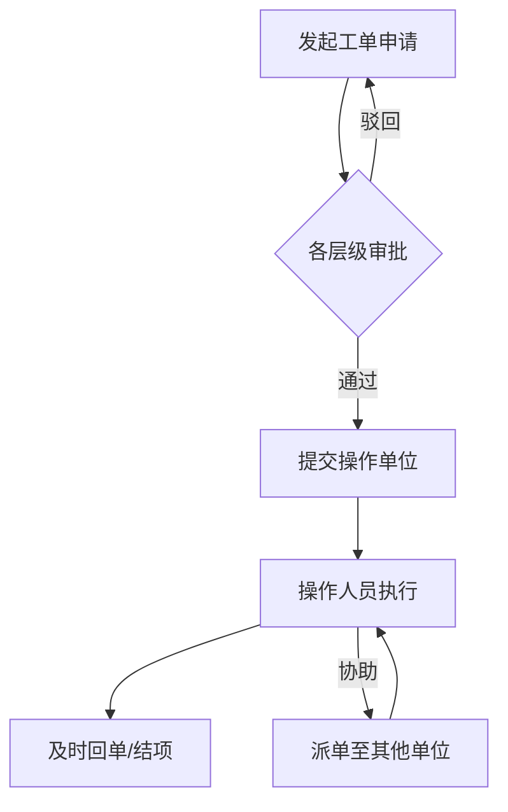

# 华南理工大学、中国电信广东公司实训课题汇总（2.2）

---

## 课题一：运维工单系统的开发
**联系导师：** 黄平 13302332400

### 课题背景介绍
目前企业有大量的运维工作，为了规范生产和管理，需要严格按单施工，逐层审批，操作留痕，需要通过系统进行管理。

为此需要开发一个运维工单管理系统，支持省市各部门发起维护工单申请（如故障、需求等），然后经过各层级审批，通过后提交到操作单位，操作人员执行后及时回单。每个操作人员登录后及时看到各自待办工单信息，也可以派单到其他单位协助处理。每日每周提供工单流转完成情况统计报表和超时预警工单。需要支持电脑WEB门户和手机APP门户等使用模式。

**业务流程图示：**

* **参考资料推荐：** 工作流引擎
* **硬件要求：** * PC机 1台：4C 8GB 内存 20GB硬盘
    * 智能手机 1台
* **数据要求：** 无
* **测试环境：** 连接互联网

---

## 课题二：一体化监控平台开发
**联系导师：** 黄平 13302332400

### 课题背景介绍
随着企业数字化转型开展，IT系统逐步上云，系统架构变得复杂，主机设备指数级增长，全栈使用PaaS组件、应用微服务化，运维对象数量急剧增加，日常运维工作压力大。为提升监控运维智能化程度，企业需要开发一套对云环境下的IT系统进行监控的工具，协助运维人员快速发现和定位问题。

开发Agent并部署在每台主机设备上，Agent部署后可以自动扫描、发现和识别此主机上安装的所有服务和组件。识别到服务和组件的技术栈后，Agent可以对不同组件采取不同的信息采集方式，Agent采集到信息后再与服务器通信传递采集到的信息，并通过监控台展示出来。

**展示信息包括：**
* **主机信息：** 包含主机CPU、内存、网卡等硬件信息以及操作系统等。
* **主机利用率：** 包括CPU使用率、内存使用率、磁盘使用情况、网卡传输情况、TCP连接信息等。
* **技术栈和服务信息：** 服务对应技术栈的metric监控信息（如SpringBoot信息的活动会话数、请求数、HTTP会话数）、服务的指标、调用链等信息。

* **参考资料推荐：** 监控、上云
* **硬件要求：** PC机 2台：4C 8GB 内存 20GB硬盘
* **数据要求：** 无
* **测试环境：** 网络连通

---

## 课题三：家庭安全监控
**联系导师：** 黄平 13302332400

### 课题背景
目前越来越多家庭出现了一些安全事故，如家里线路短路发生火灾，煤气泄漏、非法闯入等场景，基于家庭安装的摄像头形成动态视频，结合AI分析，训练算法，解决家庭AI安全监控问题，是值得探索的主题。

应用视频技术，结合AI分析，训练算法，实现对家庭重点区域和特定场景的监控、识别与告警：
1.  通过视频AI，对烟雾及火焰检测，发现就标注报警。
2.  通过视频AI，在特定时段对进入人员进行检测，发现陌生人员闯入就标注报警。
3.  **注意：** 重复的报警要过滤合并。

* **参考资料：** 视频处理、AI识别算法
* **硬件要求：** PC机 1台：4C 16GB 内存 100GB 硬盘，摄像头
* **数据要求：** 无
* **测试环境：** 网络连通

---

## 课题四：关键操作审计
**联系导师：** 黄平 13302332400

### 课题背景
目前在业务运营中，部分关键操作，除了进行账号密码身份认证外，还需要进行人证一致性校验，确保操作人员身份合规性，以及后续审计的数据完整性和可追溯性。

为此需要设计一套人证比对程序：
1.  首先在系统中注册一批用户，这批用户允许有关键操作权限，并将用户的照片保存在系统。
2.  用户通过账号密码登陆到系统。
3.  在执行关键操作时，需要在操作终端打开摄像头，对用户进行拍照，然后与后台保存的照片进行一致性比对。
4.  只有通过比对的才能进行下一步操作。
5.  **注意：** 拍照时部分用户可能采用图片或其他手段绕行（需考虑活体检测）。

* **参考资料：** 人脸识别、人证比对
* **硬件要求：** PC机：4C 8GB 内存 50GB 硬盘，摄像头
* **数据要求：** 无
* **测试环境：** 网络连通

---

## 课题五：建立城市地址路名库
**联系导师：** 黄平 13302332400

### 课题背景
目前随着互联网及通信技术的发展，各类数据极具膨胀，为了准确对文本信息进行分析，需要依托中文词库进行分词解析，以提升语义识别的准确率，其中地名是很重要的词库来源，在地址路名中，包含路、大道、巷、街等后缀。

以某城市为例，可以通过官方网站访问获取，也可以通过地图API方式调用访问，或者通过第三方平台获取后，形成：**道路名称，所属街道，所属行政区，所在城市** 的格式文件。

* **参考资料：** 网络爬虫、自然语言处理
* **硬件要求：** PC机：4C 8GB 内存 50GB 硬盘
* **数据要求：** 无
* **测试环境：** 连接互联网

---

## 课题六：运维数字员工的建设
**联系导师：** 黄平 13302332400

### 课题背景
为提升企业运营效率、为一线员工减负、为流程增效，企业采用AI+RPA等技术构建数字员工，通过软件机器人替代或辅助人类员工完成那些重复性高、规则性强或基于数据分析的复杂任务。在企业运营运维过程中，运维工作重复性高、流程性强，适合通过打造运维数字员工来提高运维效率。

**简要步骤如下：**

**1. 大模型本地部署 + RAG私有知识库**
* 可以部署 DEEPSEEK 等开源大模型在本地服务器。
* 企业知识库进行私有化部署，可部署 RAG 工具（如 anythingLLM 等）。
* 构建本地运维知识库，包括运维常见问题处理方案，构建 FAQ 问答对。
    * *例：问题：账号冻结怎么处理？ 解决方案：通过自助方式访问网址...*

**2. 应用集成**
* **开发运维申告门户：** 具备运维人员账号的增删改查（CRUD）功能。
* **前台服务：** 提供各类问题的自助查询（调用知识库能力）；遇到无法回答的问题时，提供在线记录或转人工功能。
* **后台管理：** 运维人员定期查询机器难以处理的记录，进行人工干预及回访，处理完成后自动完善知识库。

* **参考资料：** AI、RPA
* **硬件要求：** PC机：4C 8GB 内存 100GB 硬盘
* **数据要求：** 无
* **测试环境：** 连接互联网

---

## 课题七：千兆无线路由器评价分析
**联系导师：** 黄平 13302332400

### 课题背景介绍
随着千兆光网日益普及，需要配置支持 WIFI6 协议以上的千兆路由器以支持高速无线上网，为了真实评估各主流无线路由器的口碑，可以登陆到电商网站，根据用户对商品的评价，识别出产品的优劣势以及关注重点，从而客观评价无线路由器的特点。

**实施流程：**
1.  登陆主流电商网站（如京东、天猫等），筛选支持 WIFI6 及以上协议的主流无线路由器。
2.  分别获取相应的价格、规格和商品评价。
3.  通过对评价信息的自动采集、清洗加工、文本解析和分词处理，剔除异常数据。
4.  得到各款产品的优点和缺点，形成各款产品的比较图表，为消费者提供选型参考。

* **参考资料：** 网络爬虫，文本处理
* **硬件要求：** PC机：4C 8GB 内存 20GB 硬盘
* **数据要求：** 无
* **测试环境：** 连接互联网

---
如果您需要我针对其中某个课题编写更详细的实现方案或代码架构，请随时告诉我。